# Speedrun Toolkit


**Speedrun Toolkit** is an advanced, modular software framework designed for route analysis, mechanic practice, physics stabilization, graphic customization, and real-time telemetry display in **Run Pro**. Built on **MelonLoader (.NET 6 / IL2CPP)**, the toolkit provides comprehensive tools ranging from deterministic physics patching to memory-based state manipulation.

---

## Core Modules and Capabilities

### Practice and Checkpoint Management
* **Multi-Slot State Restoration:** Supports up to 5 dedicated state slots to store exact transform vectors (position, orientation, and velocity).
* **Instant State Recall:** Dedicated keybindings allow seamless saving, loading, slot switching, and target reset without reloading the scene.
* **Environmental Control:** Features a dynamic Gravity Scale modifier configurable from 0% to 1000% of nominal engine constants.

### Telemetry, Speedometer, and Crosshair Engine
* **Custom On-Screen Display:** Real-time rendering of player velocity (u/s) and absolute spatial coordinates (X, Y, Z).
* **Native OSD Suppression:** Option to disable the default game speedometer for cleaner recording streams.
* **Custom Crosshair System:** Modular reticle generator featuring Dot, Cross, and Cross-Out styles with customizable length, gap, thickness, outline, and RGBA opacity.

### Custom 3D Model Integration (Tung Tung Sahur)
* **Procedural Mesh Loading:** Native parsing and rendering of external `.obj` geometry and texture assets (`.png` / `.jpg`) directly from the local environment.
* **Velocity-Based Motion Controller:** Dynamic procedural sway, tilt, and vertical bounce algorithms tied to player ground speed and movement states.
* **Toggle Controls:** Independent runtime toggling via menu controls or keybind (**F7**).

### Hazard and Trigger Visualizer
* **Spatial Render Engine:** Visualizes invisible boundary triggers, death zones, and interaction volumes.
* **Display Modes:** Toggleable Wireframe and X-Ray modes (depth-buffer bypass for visibility through geometry).
* **Color and Material Customization:** Full RGB color selection and alpha transparency adjustment.
* **Scene Rescan Utility:** Manual trigger re-indexing button to force discovery of newly instantiated objects across scene shifts.

### Field of View (FOV) Override
* **Independent Engine Override:** Granular camera FOV adjustment ranging from 60° to 140°.
* **UI Isolation:** Filters out orthographic, canvas, and interface rendering cameras to prevent HUD skewing or clipping artifacts.

### Input Overlay System
* **Real-Time Input Monitoring:** Renders active physical inputs (`W`, `A`, `S`, `D`, `SPACE`, `LMB`).
* **Custom Palette Engine:** Features built-in color presets with automated text contrast evaluation:
  * **Green:** `RGBA(0.10, 0.80, 0.30, 0.85)`
  * **Cyan:** `RGBA(0.00, 0.80, 1.00, 0.85)`
  * **Red:** `RGBA(1.00, 0.20, 0.20, 0.85)`
  * **Yellow:** `RGBA(1.00, 0.80, 0.00, 0.85)`
  * **Pink:** `RGBA(0.90, 0.30, 0.90, 0.85)`
  * **White:** `RGBA(1.00, 1.00, 1.00, 0.85)`
  * **Dark Translucent:** `RGBA(0.10, 0.10, 0.10, 0.50)`
  * **Gray:** `RGBA(0.30, 0.30, 0.70, 0.70)`
* **Transform Controls:** Full dynamic scaling (0.6x - 2.0x) and absolute screen-space coordinate positioning.

### Physics Patching and Determinism
* **Deterministic Jumpers:** Normalizes jump box forces across varying frame rates (0.500x - 2.000x multiplier).
* **Deterministic Boosters:** Eliminates Unity `CharacterController` grounded-state friction bugs by applying a 0.15m vertical offset and a 0.15s trigger debounce window.
* **Visual Helpers:** Optional rendering of vector flight trajectories and interactive trigger bounds.
* **Anti-Abuse Verification:** Automatically invalidates and disables level completion triggers if physics constants exceed non-standard values.

### Graphics and Performance Optimization
* **Ultra Potato Resolution Presets:** Quick hardware-downscaling toggles including 480p Fullscreen, 480p Windowed, and extreme pixel render targets (320x240 4:3 and 320x180 16:9).
* **Custom Skybox Manager:** Dynamic cycling between native scene skyboxes, solid black background, and external custom skybox images (`.png` / `.jpg`) loaded from disk.
* **Draw & Shadow Distance Override:** Independent distance control sliders allowing custom Camera Render Distance (50m - 3000m) and Shadow Distance (0m - 500m).
* **Rendering Pipelines Toggles:** Ability to independently disable Post-Processing (Bloom, FX) and global shadows for maximum framerate stability.
* **FPS Limiter & Presets:** Granular target frame rate input with standard high-refresh rate presets (Max, 60, 120, 144, 240, 360 FPS).
* **Texture Downscaling & Interface Cleaners:** Texture resolution scaling (High, Medium, Low) along with toggles to hide first-person hand meshes and the native game HUD.
* **Dark Mode GUI Theme:** Dark interface overlay style with adaptive dynamic UI scroll height calculation.

### Audio and Custom Music Replacer
* **Independent Audio Manager:** Background audio controller capable of scanning, loading, and replacing game tracks with local `.mp3` and `.wav` audio files.
* **Pitch and Speed Modifier:** Dynamic playback pitch and speed manipulation ranging from 0.50x to 2.00x in real-time.
* **Playback Modes:** Flexible track sequencing including Selected Track mode, Name-based matching, and Shuffle mode.
* **Master Volume & Real-time Scan:** Smooth volume scaling slider and live directory rescan functionality without restarting the application.

### Time Dilation (Slomo)
* **Scale Modifier:** Adjusts global engine time scale (0.25x - 1.00x) for frame-perfect input practice and movement analysis.
* **Hotkey Controls:** Quick increment, decrement, and reset via Numpad keys.

---

## Default Controls and Keybindings

| Action | Keybinding | Module Context |
| :--- | :---: | :--- |
| **Toggle Toolkit Menu** | `F8` | Global Interface |
| **Toggle Custom Music Player** | `F7` | Audio Module |
| **Toggle Tung Tung Model** | `F7` | Model Module |
| **Save Checkpoint State** | `F9` | Practice Module |
| **Load Checkpoint State** | `F10` | Practice Module |
| **Next Checkpoint Slot** | `PageDown` | Practice Module |
| **Previous Checkpoint Slot** | `PageUp` | Practice Module |
| **Teleport to Spawn** | `F11` | Practice Module |
| **Reset Checkpoint & Respawn** | `R` | Practice Module |
| **Teleport** | `T` | Practice Module |
| **Air Dash** | `E` | Movement Tweaks |
| **Infinite Jump** | `Space` | Movement Tweaks |
| **Adjust Game Speed** | `Numpad +` / `Numpad -` | Slomo Module |
| **Reset Game Speed** | `Numpad *` | Slomo Module |

---

## Workspace and Asset Directory Structure

```text
Run Pro/
├── Mods/
│   └── SpeedrunToolkit.dll
└── UserData/
    ├── CustomMusic/             (Local Audio Files: .wav, .mp3)
    │   ├── track1.mp3
    │   └── track2.wav
    │
    ├── CustomSkyboxes/          (Custom Skybox Images: .png, .jpg)
    │   └── skybox1.png
    │
    └── SpeedrunToolkit/         (3D Model & Texture Assets)
        ├── tungtung.obj
        └── tungtung.pngwav
```

## Screenshots:

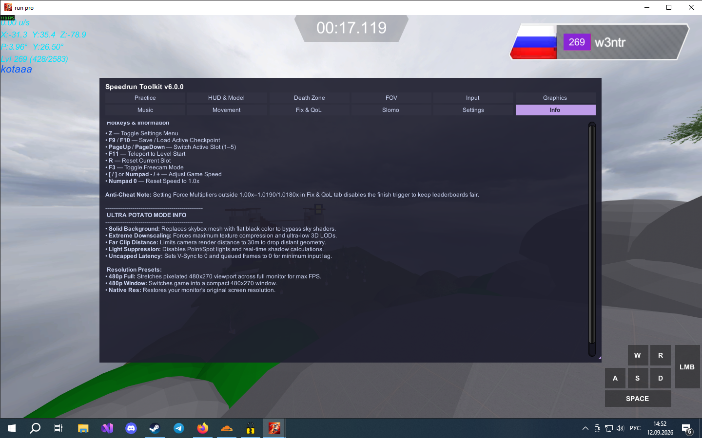 
*The Info of Mod.*
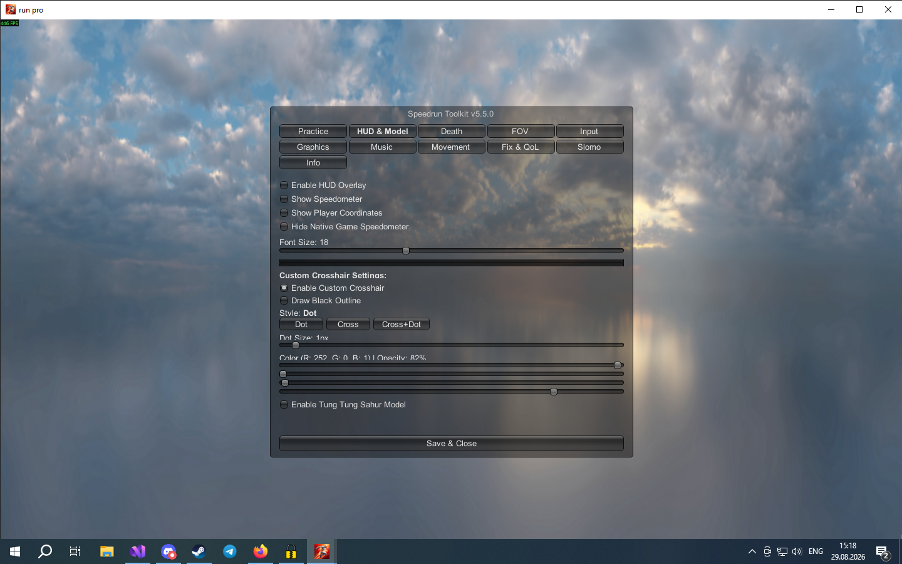
*Hud and Model (Tung Tung Tung Sahur)*
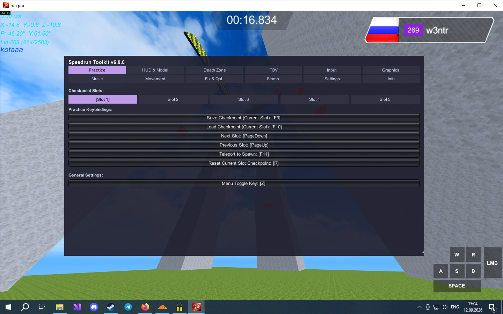
*Practice Functions (Also keybind [T] - Teleport)*
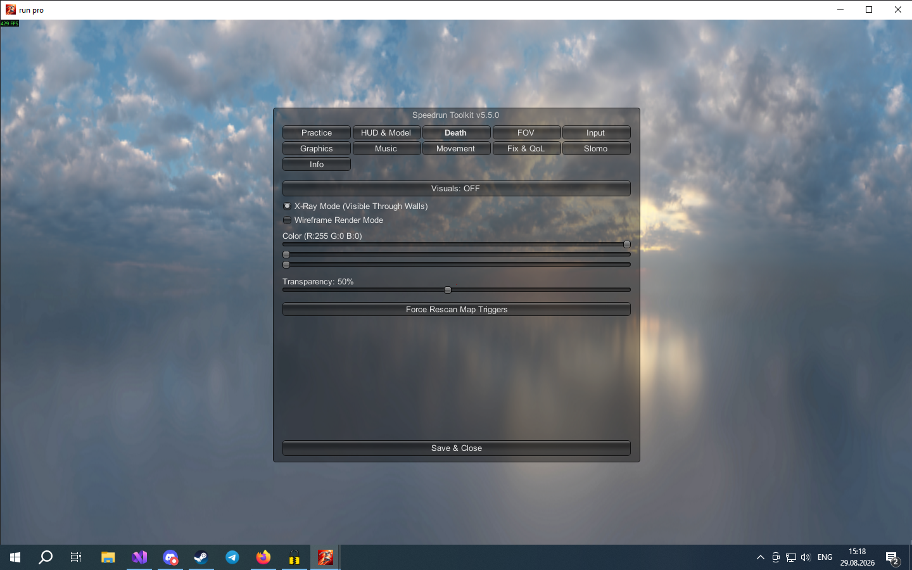


*Death Zone triggers highlighted in X-Ray mode* 
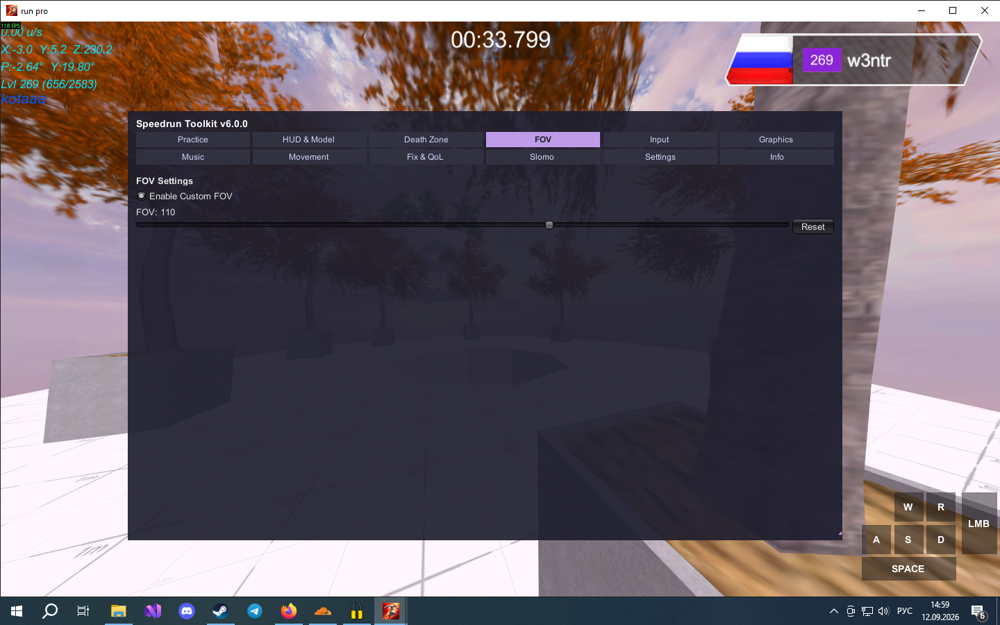
*FOV - 60-140*
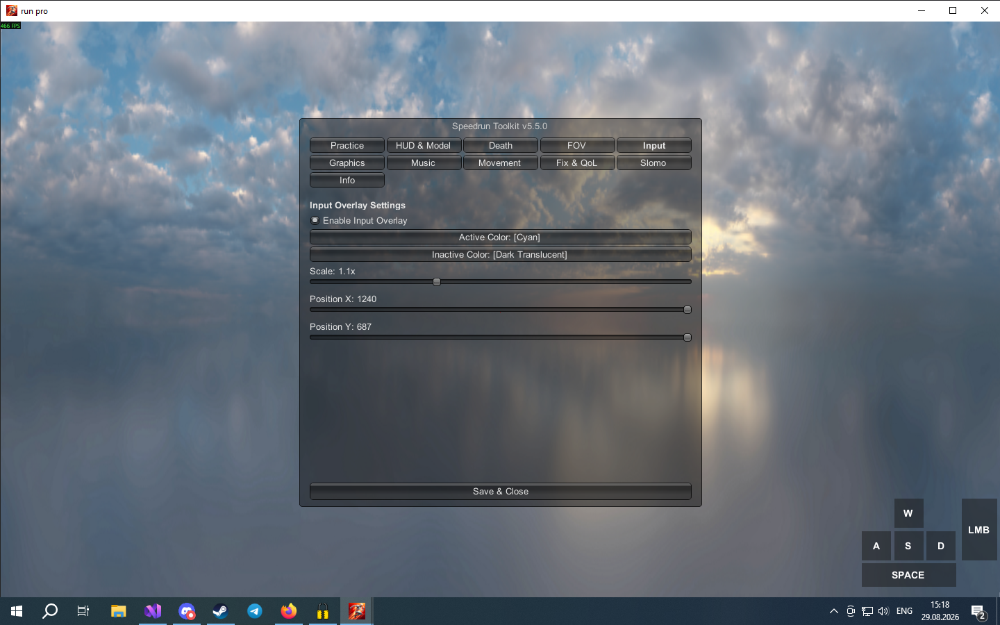
*Deep input customization with colors, font, and position*
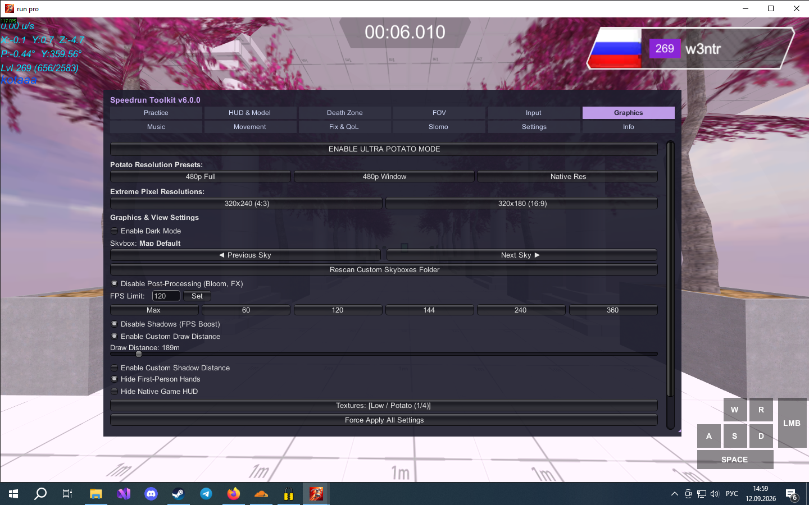
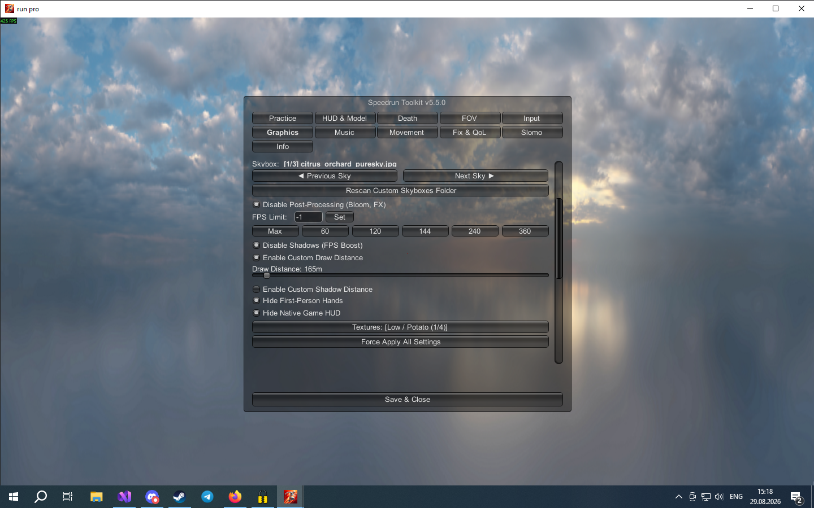
*Deep graphics customization, allowing you to change the Skybox as well*
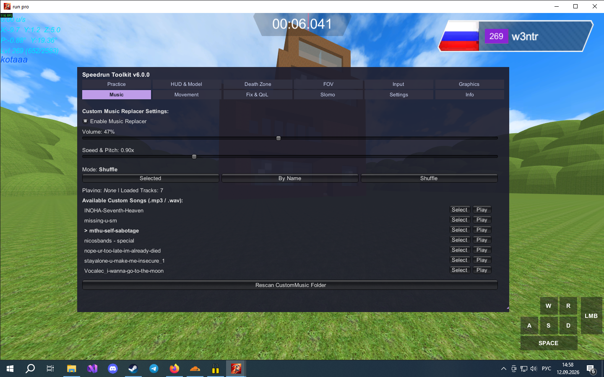
*Custom Music Replacer*
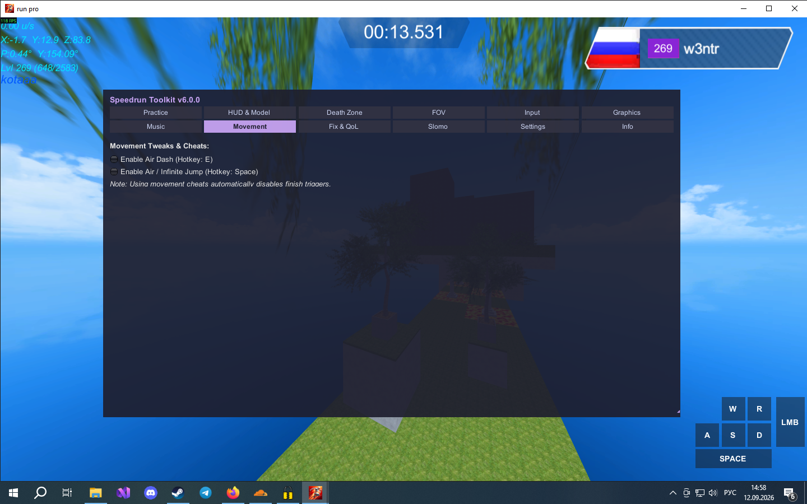
*Fun tab*
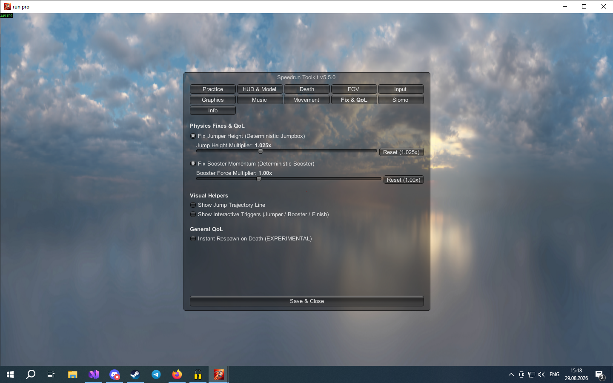
*Fixing and improving the game's physics*
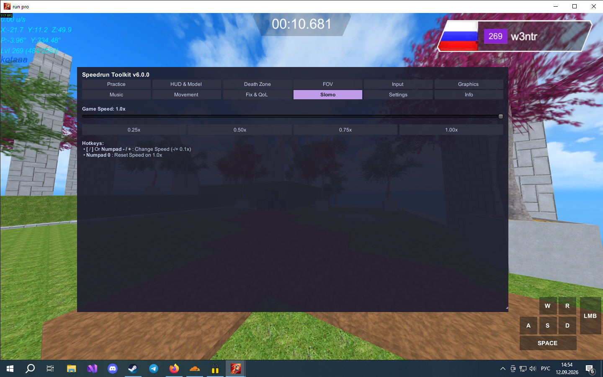
*Slomo*

## Installation Guide

1. Download and install MelonLoader (target runtime: .NET 6 / IL2CPP) into the root game directory.

2. Obtain SpeedrunToolkit.dll from the official repository release section.

3. Place SpeedrunToolkit.dll into the Run Pro/Mods/ directory.

4. (Optional) Place custom audio assets (.wav or .mp3) into UserData/CustomMusic/.

5. (Optional) Place custom skybox textures (.png or .jpg) into UserData/CustomSkyboxes/.

6. (Optional) Place custom mesh assets (tungtung.obj, tungtung.png) into UserData/SpeedrunToolkit/.

7. Launch the executable. Configuration files will automatically generate in UserData/MelonPreferences.cfg.

## Technical Specifications

- Target Framework: .NET 6.0

- Modding Environment: MelonLoader v0.6.0+

- GUI Subsystem: Unity IMGUI (UnityEngine.IMGUIModule) with unified viewport scroll handling

- Interop Layer: Il2CppInterop / HarmonyLib

- GUI Subsystem: Unity IMGUI (UnityEngine.IMGUIModule)
