# Speedrun Toolkit

**Speedrun Toolkit** is a feature-rich mod designed for practicing, training, and recording speedruns in **Run Pro**. Built specifically for **MelonLoader (.NET 6 / IL2CPP)**, it provides custom HUD customization, checkpoint practice systems, death zone visualization, FOV modification, an input overlay, and a dedicated custom music player.

---

## 🚀 Key Features

### 🎯 Practice Module
* **Save / Load Checkpoint**: Instantly save and restore player position and camera angles at any moment.
* **Teleport to Spawn / Reset**: Quickly return to the spawn point or clear saved practice checkpoints.
* **Rebindable Keybindings**: Full control over practice hotkeys directly from the in-game menu.

### 📊 HUD & Speedometer
* **Text Customization**: Adjust font size, font style (*Bold*, *Italic*), and value colors.
* **Opacity & Positioning**: Customize background panel opacity and move the HUD freely across X and Y axes.
* **Native Speedometer Toggle**: Option to completely hide the default in-game speedometer.

### 💀 Death Zones Visualizer
* **Trigger Highlight**: Renders invisible death triggers and hazard hitboxes across the map.
* **Display Modes**: Toggle between **X-Ray** (see through walls) and **Wireframe** modes.
* **Full Customization**: RGB color picker and transparency sliders for rendered materials.
* **Force Rescan**: Manual map rescan button to discover newly loaded hazards.

> **Important Note regarding Death Zones:**  
> The module's state (`Visuals: ON`) persists in the configuration file across game sessions. However, due to how Unity reinstantiates objects on scene reloads, triggers may occasionally become invisible after loading a new map. If `Visuals` is enabled but zones are not visible, simply toggle **Visuals: OFF** and back **ON** in the menu to refresh them.

### 👁️ FOV Changer
* **Smooth Slider**: Adjust field of view from `60` to `140` degrees in real time.
* **UI Protection**: Smart filtering bypasses orthographic and UI cameras, keeping HUD overlays from stretching or distorting.
* **Reset Button**: One-click restore to the game's default FOV.

### ⌨️ Input Overlay
* **Compact Layout**: Shows only necessary inputs for speedrunning (`WASD`, `SPACE`, and `LMB`).
* **Custom Palette**: Independent color selection for active and inactive key states, featuring automatic font contrast adjustments (black/white text depending on background brightness).
* **Scaling & Position**: Adjust scale from `0.6x` to `2.0x` and position anywhere on screen.

### 🎵 Custom Music Replacer
* **Standalone Module**: Operates in a separate IMGUI window to keep the main menu uncluttered.
* **Dedicated Keybind**: Toggled independently using **F7** by default (fully rebindable).
* **Auto-Scanning**: Scans `.wav` files located in `UserData/CustomMusic` and automatically generates a playable track list.

---

## 🕹️ Default Keybindings

| Action | Default Key | Module |
| :--- | :---: | :--- |
| **Open Main Menu** | `F8` | General |
| **Open Music Player** | `F7` | Custom Music Replacer |
| **Save Checkpoint** | `F9` | Practice |
| **Load Checkpoint** | `F10` | Practice |
| **Teleport to Spawn** | `F11` | Practice |
| **Reset Checkpoint & Teleport to Spawn** | `R` | Practice |

*All keybindings can be rebound in the **Practice** tab or edited directly in the config file.*

---

## 📸 Screenshots

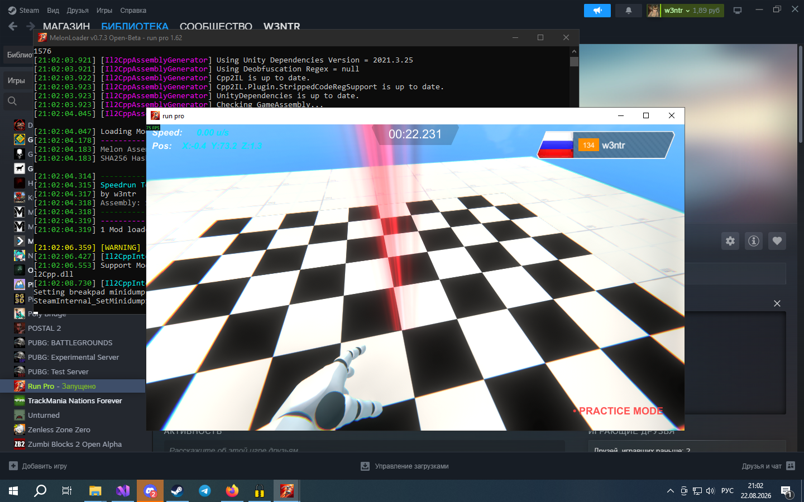
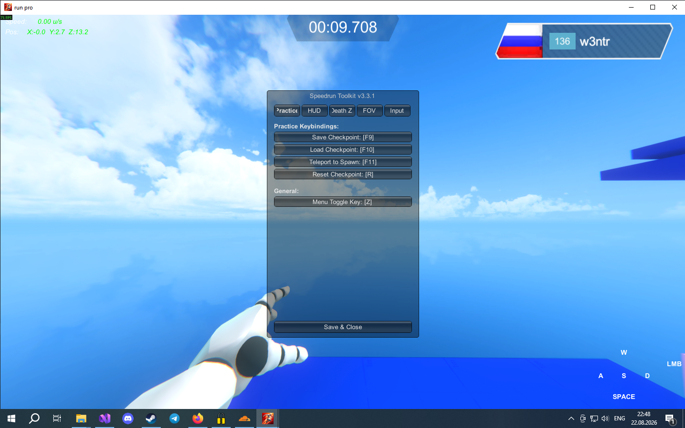
*Main settings interface and keybindings configuration*

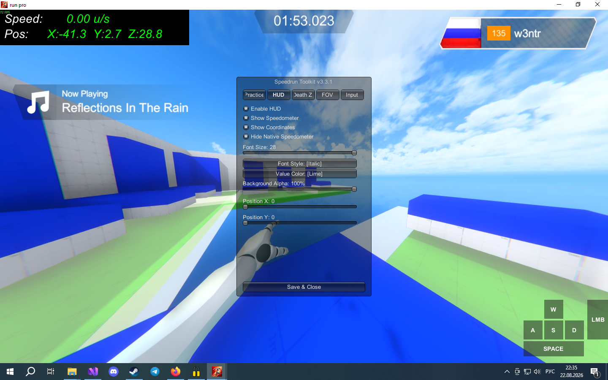
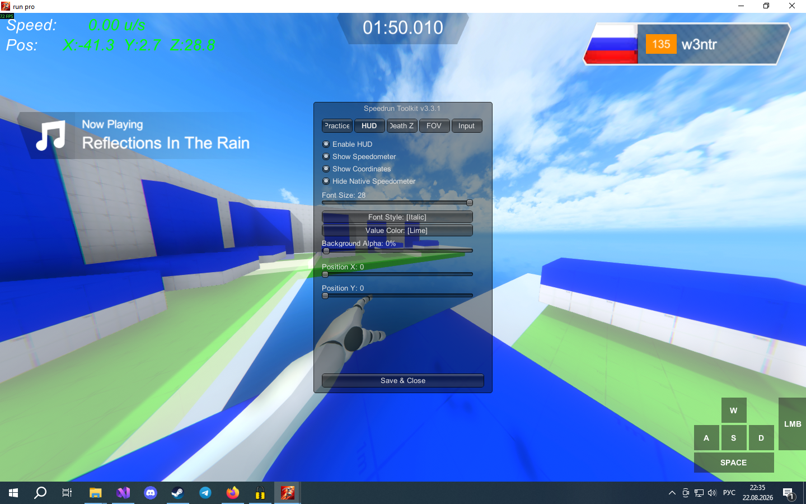
*Custom speedometer and coordinates setup*

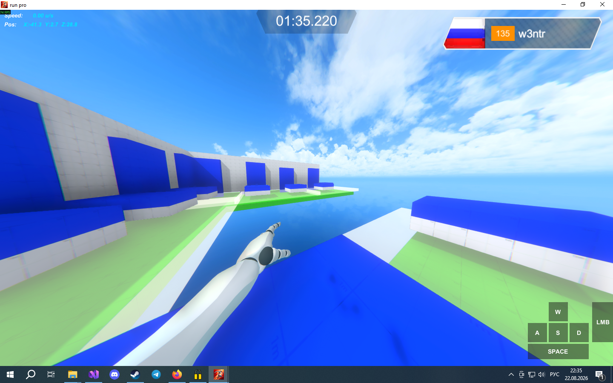
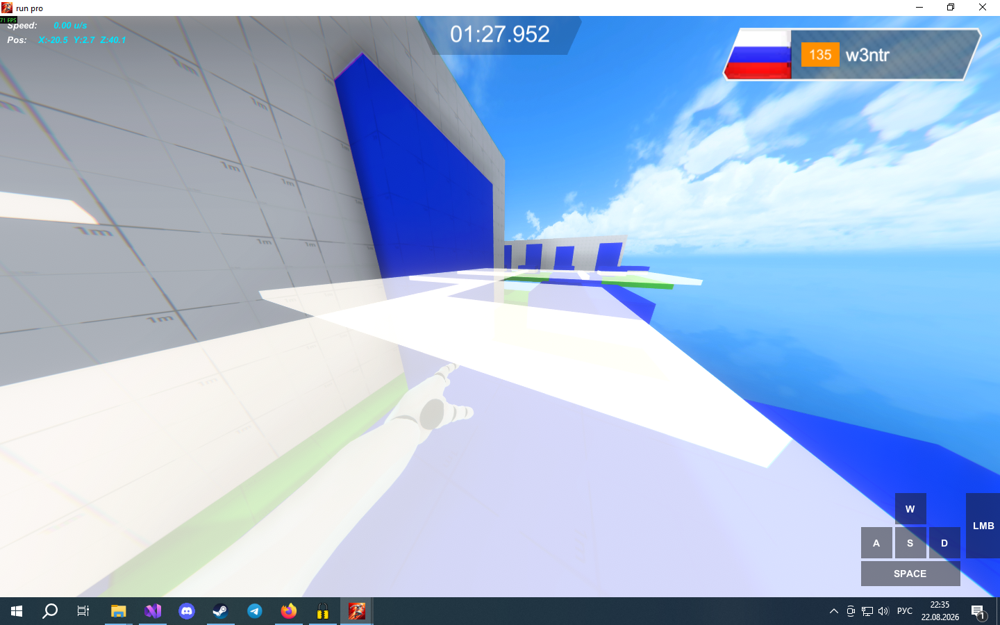
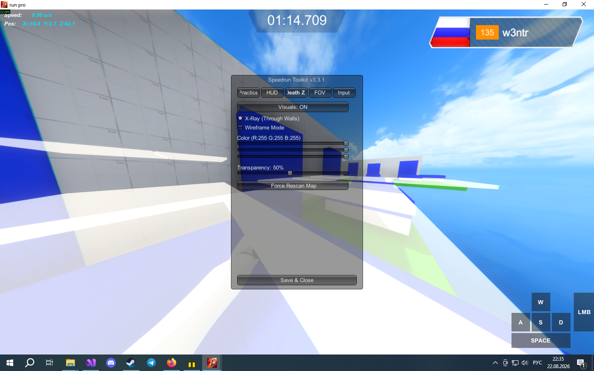
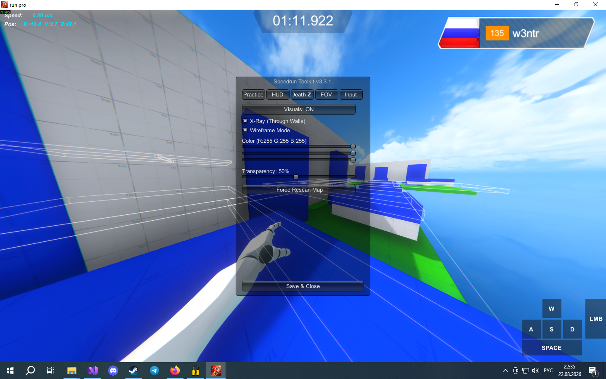
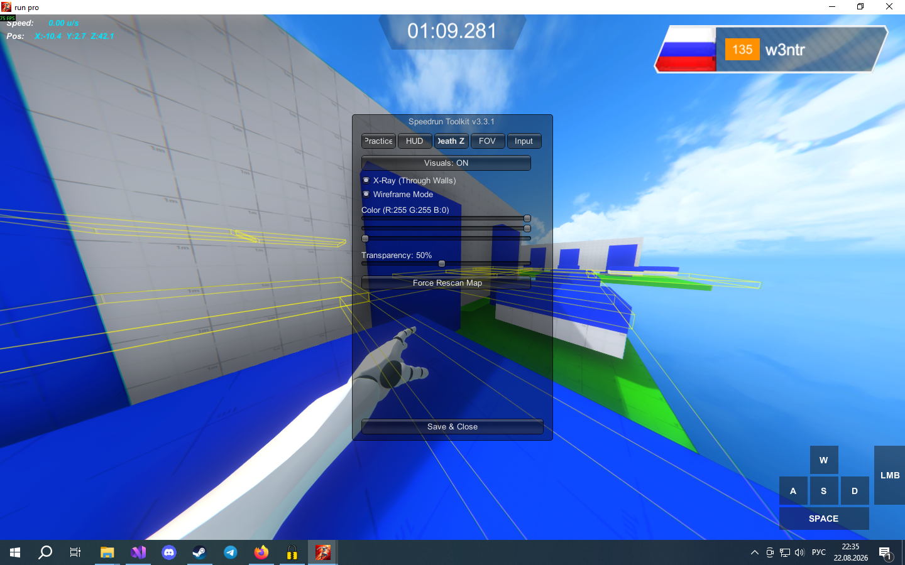
*Death Zone triggers highlighted in X-Ray mode*

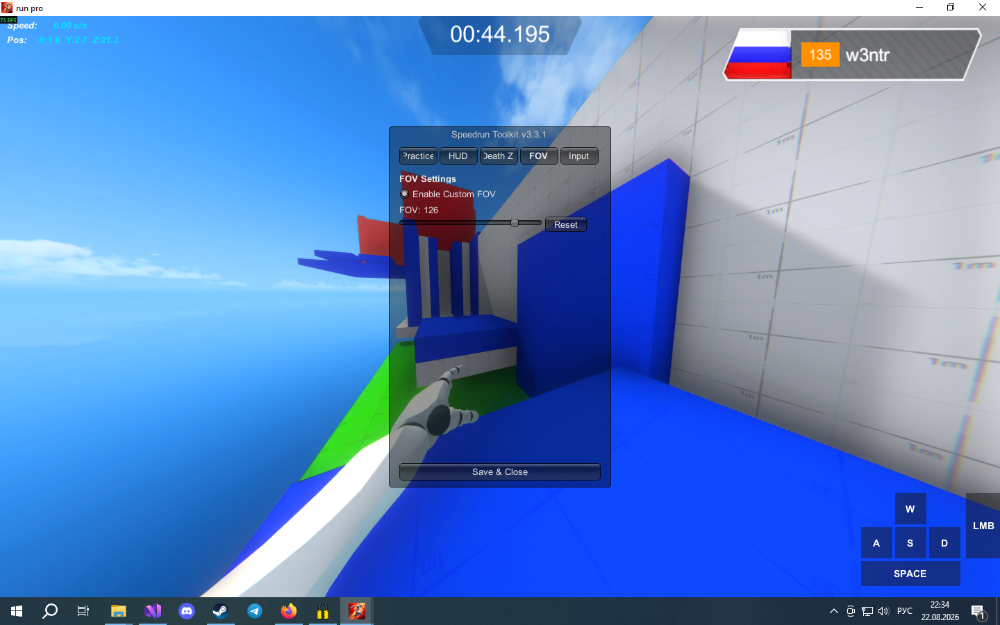

*Real-time Input Overlay alongside custom FOV*

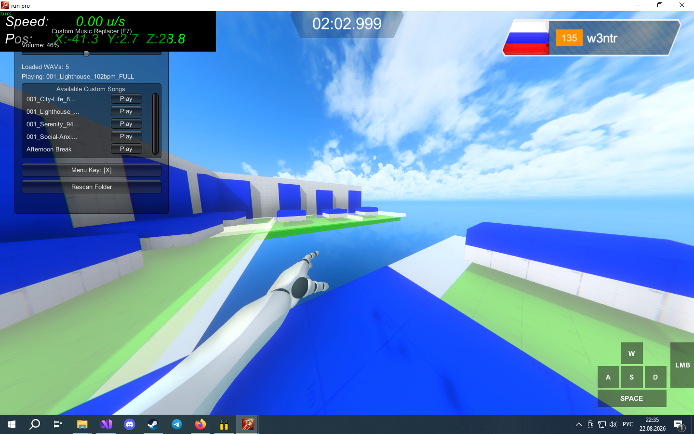
*Real-time Replace Music in the game*

---

## 📥 Installation

1. Download and install **MelonLoader** (target: **.NET 6 / IL2CPP**) into your *Run Pro* game folder.
2. Download `SpeedrunToolkit.dll` from the **Releases** tab.
3. Place `SpeedrunToolkit.dll` inside the `Mods/` directory located in your game folder.
4. *(Optional)* To use custom music, create a folder named `UserData/CustomMusic` and place your `.wav` files there.
5. Launch the game. Configuration files will be generated automatically.

---

## 🛠️ Built With
* **C# / .NET 6**
* **MelonLoader v0.6+**
* **Unity IMGUI** (`UnityEngine.IMGUIModule`)
* **Il2CppInterop**
